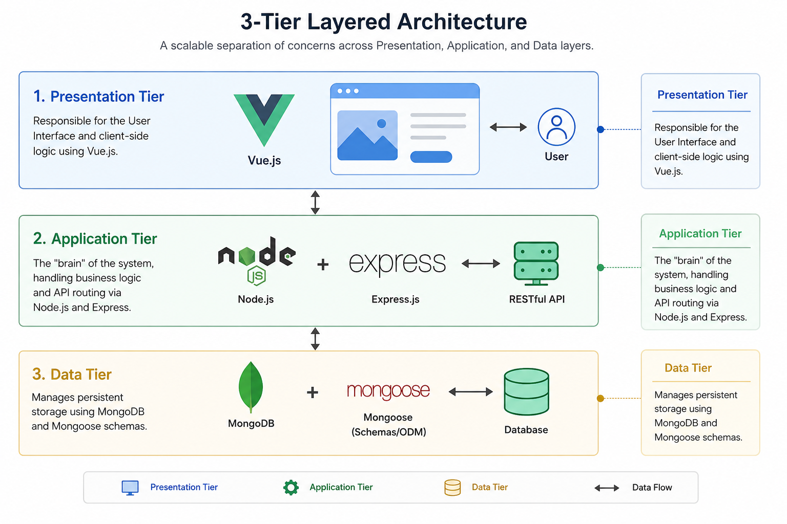
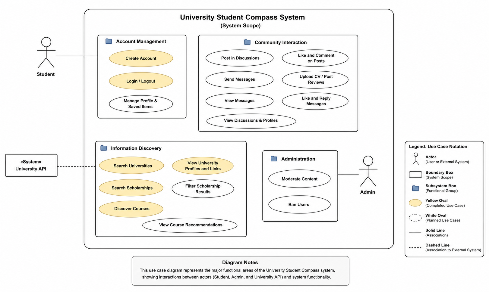
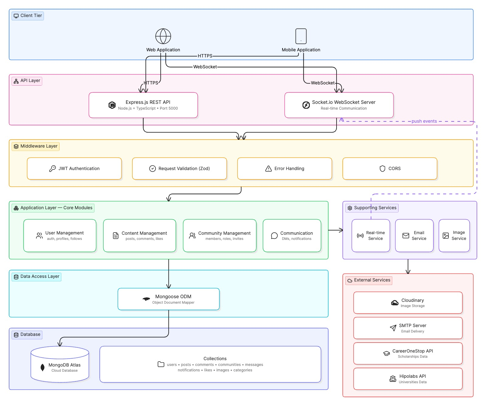
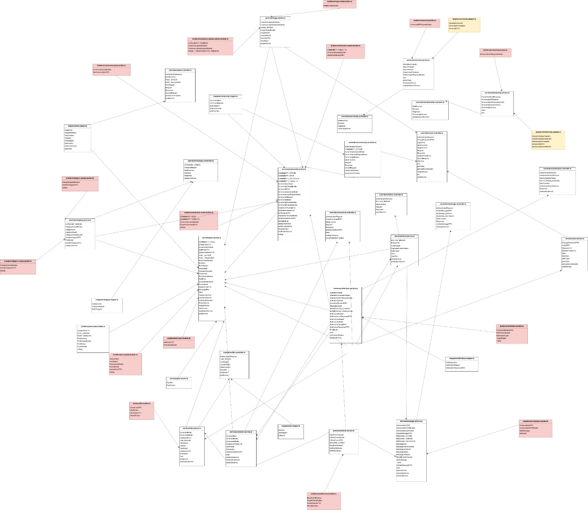
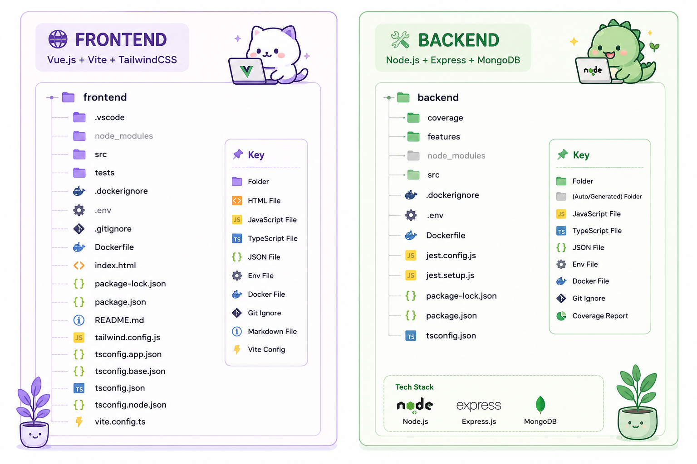
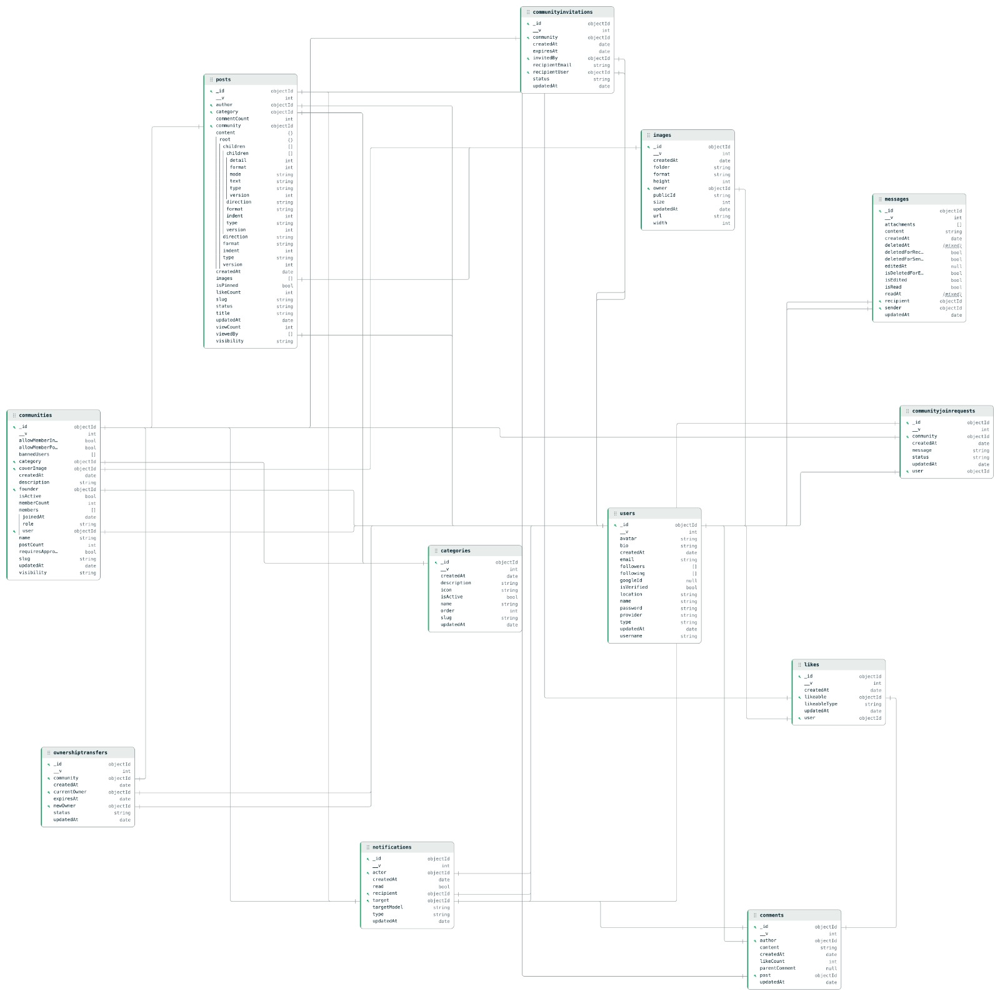

# Software Architecture Document (SAD)

## Table of Contents
1. [Introduction](#1-introduction)
    * [1.1 Purpose](#11-purpose)
    * [1.2 Scope](#12-scope)
    * [1.3 Definitions, Acronyms and Abbreviations](#13-definitions-acronyms-and-abbreviations)
    * [1.4 References](#14-references)
    * [1.5 Overview](#15-overview)
2. [Architectural Representation](#2-architectural-representation)
3. [Architectural Goals and Constraints](#3-architectural-goals-and-constraints)
4. [Use-Case View](#4-use-case-view)
5. [Logical View](#5-logical-view)
    * [5.1 Overview](#51-overview)
    * [5.2 Architecturally Significant Design Packages](#52-architecturally-significant-design-packages)
    * [5.3 Class Diagrams](#53-class-diagrams)
6. [Process View](#6-process-view)
7. [Deployment View](#7-deployment-view)
8. [Implementation View](#8-implementation-view)
9. [Data View](#9-data-view)
10. [Size and Performance](#10-size-and-performance)
11. [Quality](#11-quality)

---

# Software Architecture Document (SAD)
*(Based on RUP Template)*

## 1. Introduction

### 1.1 Purpose
This document provides a comprehensive architectural overview of the "International Student Compass" system. It captures the significant design decisions made to ensure the system is scalable, maintainable, and decoupled.

### 1.2 Scope
This architecture covers the Vue.js frontend, the Node.js/Express API, and the MongoDB data tier. 

### 1.3 Definitions, Acronyms and Abbreviations
| Abbreviation | Explanation |
| :--- | :--- |
| **SAD** | Software Architecture Document |
| **SRS** | Software Requirements Specification |
| **UC** | Use Case |
| **API** | Application Programming Interface |
| **tbd** | to be determined |
| **UCD** | overall Use Case Diagram |
| **FAQ** | Frequently asked Questions |

### 1.4 References
* **Project Blog:** [International Student Compass Blog](https://education4849.wordpress.com/)
* **Software Requirements Specification (SRS):** [View SRS on GitHub](https://github.com/DanielMiuta24/students-platform/blob/main/SRS.md)

### 1.5 Overview
This document contains the structural blueprints governing our decoupled solution. Section 2 maps our core tiers. Sections 3 through 5 define design restrictions and class mappings. Sections 6 through 9 break out our runtime processes, deployments, monorepo packages, and data persistence models, while Sections 10 and 11 list performance targets.

---

## 2. Architectural Representation
The system follows a **3-Tier Layered Architecture** pattern to guarantee clean component separation.

* **Presentation Tier:** Responsible for the User Interface and client-side logic using Vue.js.
* **Application Tier:** The "brain" of the system, handling business logic, service tasks, and API routing via Node.js and Express.
* **Data Tier:** Manages persistent storage using MongoDB and Mongoose schemas.

---

## 3. Architectural Goals and Constraints
* **Decoupled Design:** The frontend and backend communicate strictly via a RESTful API over secure channels.
* **Hardware Inclusivity:** The architecture is optimized for "Web-First" access on legacy desktop hardware, ensuring students without high-end devices can access all features efficiently.
* **Real-time Capabilities:** Use of WebSockets via Socket.IO to manage high-concurrency community chat operations.

---

## 4. Use-Case View
This view represents the functional requirements that shape the structural boundaries of the architecture.

**Diagram Legend:**
* **Yellow Ovals:** Completed Core Features (e.g., `UC-01`, `UC-02`).
* **White Ovals:** Planned Features (e.g., Scholarships, Course Curation).
* **Boundary:** The explicit system scope for the International Student Compass.

> **Note:** Detailed behavioral logic and Activity Diagrams are excluded from the SAD and are located within the standalone **Use Case Specification** documents.

---

## 5. Logical View

### 5.1 Overview
Our elements are categorized by model, view, and controller layers to preserve system isolation boundaries.

**Data Flow Sequence:**
1. **User Interaction (View):** A user interaction triggers a function to handle form submission or navigation.
2. **Request Handling (Controller):** The Controller receives the request, validates the payload, and passes it to the core services layer.
3. **Database Interaction (Model):** The Model interacts with our database and performs data operations.
4. **Response:** The Controller sends back the JSON result, which is handled by the view layer to update the UI.

| Architectural Tier | Package/Folder | Significant Classes/Files |
| :--- | :--- | :--- |
| **Presentation** | `src/views`, `src/components` | `HomeView.vue`, `SearchView.vue`, `ChatComponent.vue` |
| **Application** | `server/controllers`, `server/routes` | `AuthController.js`, `SearchController.js`, `ChatHandler.js` |
| **Data** | `server/models` | `UserSchema.js`, `UniversitySchema.js`, `ThreadSchema.js` |

To visualize how our application is structured, we created a Client-Server Architecture diagram. It shows the main components on the **Client Side** (the user’s browser running our Vue.js app), the **Server Side** (our Node.js/Express API handling requests and logic), and the **Database** (MongoDB storing our data), along with the communication paths (HTTP/REST, WebSockets, Database Queries) between them.

### 5.2 Architecturally Significant Design Packages
* **Socket.IO:** Critical for the "Real-time" goal of peer-to-peer chat.
* **Mongoose:** Essential for enforcing strict data schemas in our NoSQL database.
* **Axios:** the primary HTTP client handling our decoupled REST communication.
* **Vite:** Core build tool utilized for bundle optimization to support legacy hardware performance.
  
### 5.3 Class Diagrams
To provide full structural transparency, our class architecture is documented across three evolutionary stages: the initial tool-generated code reflection, our high-level conceptual planning, and our finalized manual implementation model.

#### 5.3.1 Tool-Generated Class Diagram
This baseline diagram reflects our raw, reverse-engineered codebase structures directly out of our automated tooling, showcasing raw model bindings.

#### 5.3.2 Conceptual Class Diagram
Our initial manual mapping used to define structural relationships before implementation refactoring loops took place.

#### 5.3.3 Finalized Manual Class Diagram
The production-ready, manually refined class mapping showing precise encapsulation parameters, method vectors, and strict controller-to-schema dependencies.

---

## 6. Process View
This view illustrates the dynamic request flow across boundaries. When a user searches for a university, the data flows as follows:
1. **View:** User enters a query string in `SearchView.vue`.
2. **Controller:** The `SearchController.js` receives the HTTPS request via a REST endpoint.
3. **Model:** The controller queries the `UniversitySchema` in MongoDB.
4. **Response:** Data is sent back as JSON and rendered dynamically in the View.

---

## 7. Deployment View
The system uses a physical **Client-Server Architecture** mapped onto network nodes.

* **Client Node:** User web browser (Chrome, Firefox, Safari, Edge) running on legacy or modern hardware.
* **Server Node (VPS):** A Linux-based Virtual Private Server hosting our containerized Node.js environment.
* **Database Node:** A dedicated MongoDB instance running securely on an isolated cloud thread.

---

## 8. Implementation View
The system is implemented using a unified **Monorepo** structure to simplify Docker orchestration across local and production nodes.

* **`root/`**: Contains the `docker-compose.yml` and environment configurations.
* **`/frontend`**: Vue.js application using Vite for thin-client, optimized builds.
* **`/backend`**: Node.js/Express application logic server.
* **`/docs`**: Contains the SAD, SRS, and API contracts (Swagger/Bruno).

---

## 9. Data View
Our storage design utilizes a NoSQL approach to match the dynamic attributes of international university and scholarship records. Data schemas enforce data formatting rules across collections:

* **User Collection:** Handles authentication states, credentials, and basic user profiles.
* **Message Collection:** Keeps structured logs of peer-to-peer chat histories and connection metadata.
* **University/Scholarship Collection:** Houses indexed university profiles and funding entries.

---

## 10. Size and Performance
* **Efficiency:** The frontend utilizes code splitting and lazy-loading for heavy routes (`SearchView.vue`, `ChatComponent.vue`) to keep the initial DOM content load under 1.5 seconds on legacy devices.
* **Memory Constraints:** The Node.js API is resource-capped to run within a 512MB RAM container environment, ensuring high performance on low-cost VPS instances.
* **Database Indexing:** MongoDB compound indexes are applied directly to `UniversityName` and `Location` attributes to ensure query results resolve in under 200ms for datasets up to 10,000 entries.

---

## 11. Quality
* **Uptime Thresholds:** The architecture is engineered to support a minimum monthly availability factor of 99.5% with sub-500ms server-side latency targets. This accommodates a maximum load capacity of 500 concurrent operational actors executing standard interactions simultaneously.
* **Scalability:** Horizontal scaling capabilities are preserved via VPS cluster configurations to accommodate user base growth.
* **Efferent Coupling ($Ce$):** Target $Ce < 10$ for all core application logic packages to guarantee a highly maintainable, decoupled system layer.
* **Component Dependency:** Monitored and validated via dependency analysis tools (Madge) to identify and completely block circular dependencies between the API layers and Database models.
